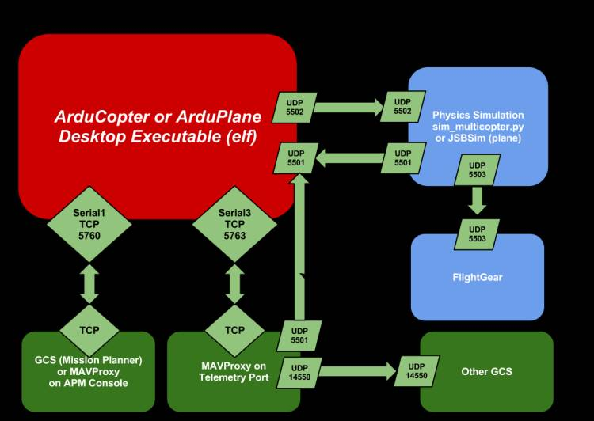

## Working with SITL
Working with SITL is nothing different from writing normal ROS scripts. I am not providing a boiler plate this time since I expect you to have become accustomed to files' layout in a ROS package. 

**Objective :** 
1. Create a ROS Package which interacts with SITL Environment and Gazebo, using MAVProxy Protocol. 
2. Takeoff the drone at the spawn position, upto a height of 2m
3. Move the drone in square (you may hardcode the local position coordinates), and back to the original position.
4. Land back the drone in the same spot where it was spawned

**Note:** It would be better if you could ``ROSINFO`` (verbose) out your current ongoing task & current coordinates (if the drone is traversing) on the terminal, for better error handling and evaluation.

If you are conufsed where to get started. **Go through the source code of** [this](https://github.com/Intelligent-Quads/iq_gnc) **API**. (You may also go through the creator's [playlist](https://github.com/Intelligent-Quads/iq_tutorials/blob/master/README.md) or [documentation](https://github.com/Intelligent-Quads/iq_gnc/blob/master/docs/py_gnc_functions.md) on using the API to get a better idea of SITL)  It is intended to form a wrapper over the ROS/SITL framework. We refrain from utilizing this API due to its limited capabilities, as our tasks often demand the creation of intricate packages involving complex computations.

</img>

You may also refer to the ``communication`` package in this [repo](https://github.com/pulak-gautam/Object-Detection-via-ROS-Darknet/tree/master/communication) created by Atulya and me.

Please make a PR into your branch only!